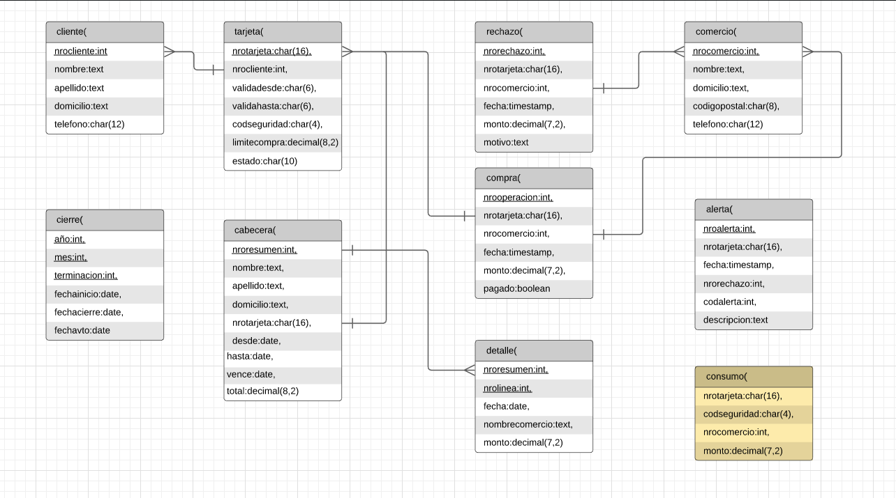

= Base de Datos: Trabajo Práctico 1
Martin Sosa <@gmail.com>; Maxi Schmidt <@gmail.com>; Martin Zavalla <martin.zav99@gmail.com>
v1, {docdate}. Docentes Hernán Czemerinski y Hernán Rondelli (COM-01)
:title-page:
:numbered:
:source-highlighter: coderay
:tabsize: 4

== Introducción

En este trabajo se realizará una base de datos en postgreSQL mediante Go, 
donde se representa un modelo de datos que se usa para almacenar
informacion relativa a clientes de tarjetas de credito, donde se destacan los detalles
de compra, total de gastos, infomación del comercio y el producto, rechazos
o alertas e incluso, información sobre la propia tarjeta y su propietario.

El objetivo del programa es que reconozca y actúa ante situaciones tales como 
autorización de compra, generar resumenes o alertar a los clientes de posibles
problemas. Para ello, se deberá previamente crear una base de datos respetando 
las propiedades de cada tabla , e instanciar datos competentes.

Además, como usuario tendrá la posibilidad de crear la base de datos manualmente
y ver el paso a paso de su proceso o la opcion de que se realice todo automanicamente.
Una de estas es borrar todas las identifiaciones primareas y foraneas (PK's y FK's) que
solo se puede realizar mediente la opcion manual.
 

== Descripción

El programa inicia mostrando un menú princpipal de bienvenida (CLI) para un manejo
más ordenado con la base de datos. Donde se podra elegir entre crearla y cargarla
con toda la informacion necesaria automaticamente o hacerlo manualmente. Tambien
se le agrega una tercer opcion que es para realizar pruebas de funcionamiento.
Por ultimo , se encuentra la opcion de salir.

*Modelo de menu principal*

		[ 1 ] Crear Base tpgossz (Auto)
		[ 2 ] Crear Base tpgossz (Manual)
		[ 3 ] Remover PKs y FKs
		[ 4 ] Realizar consumos de prueba
		[ 5 ] Guardar datos (BoltDB)

		[ 0 ] Salir

		
La primera opción es la encargada de crear la base de datos completa 
con tablas, PK's, FK's, clientes,negocios y funciones de forma automatica. 

*Entre las funciones se encuentran:*

*Autorizacion de compra:* donde se verifica la existencia de una tarjeta 
mediante su número y código de seguridad, el estado de vigencia y su límite
de compra. Así, se puede validar la compra o generar un rechazo para luego
cargar la información en su respectiva tabla dependiendo del resultado.

*Generar resumen:* en la cual se devuelve la información detallada de un cliente
y el total de gastos junto a infomación sobre todas sus compras realizadas en
un periodo específico.

*Generar alertas:* que posee una lógica para generar alertas por fraudes.
Esta debe ejecutarse cada cierto tiempo de forma automática, donde las
alertas a detectar se basan en la compra de productos en diferentes comercios
dentro de un rango de tiempo dependiendo de si sucede en locales de igual o
distinto código postal. Luego, se guardan los datos en su respectiva tabla con
un código identificador para saber que tipo de alerta se produjo.

La segunda opción muestra un menu secundario con las opciones para realizar 
las mismas acciones que la opción 1, pero con la posibilidad de eliminar la 
base de datos creada, crearla manualmente, conectarse, crear las tablas requeridas 
para el funcionamiento, agregar los PK's y FK's, completar la base de datos con 
información (popular la base de datos), agregar funciones, y por último, 
salir o desconectarse.

En la tercera opción podemos eliminar los PK's y FK's de todas las tablas existentes
para visualizar posibles inconvenientes al no poseer y prescindir de las mismas.

En la cuarta opción se crea una tabla con consumos virtuales para probar el sistema, 
la misma contiene los atributos: nrotarjeta, codseguridad, nrocomercio, monto. Y se realiza
un procedimiento de testeo, que pida autorización para todos los consumos virtuales.

En la quinta opción, y por último, para poder comparar el modelo relacional con un modelo no 
relacional NoSQL, se guardan los datos de clientes, tarjetas, comercios, y compras (tres por 
cada entidad y de forma hardcodeada) en una base de datos NoSQL basada en JSON. Para ello, 
utilizamos la base de datos BoltDB.

*Modelo de menu secundario*

		[ 1 ] Eliminar Base tpgossz
		[ 2 ] Crear Base tpgossz
		[ 3 ] Conectar con Base tpgossz
		[ 4 ] Crear tablas
		[ 5 ] Agregar PKs y FKs
		[ 6 ] Popular Base de datos
		[ 7 ] Agregar Stored Procedures y Triggers

		[ 0 ] Volver
		
Cada vez que el usuario elija una opción la función se ejecutará y hará un seguimiento
con impresiones por pantalla para indicar su estado y correcto funcionamiento. 

En caso de no elegir la opción de salida válida, se mostrará un mensaje
"No elegiste ninguno" y se volverá al menu para seleccionar la siguiente tarea.
    

=== Dificultades y Procedimientos

_Inicio y Planificación del Proyecto_

Para empezar a modelar la base de datos decidimos utilizar el programa *lucidchart*
debido a que nos permitio de forma mas comoda organizar y ordenar las relaciones
entre las entidades. 

.diagrama_base 

_Creando Tablas, PK's y FK's_

Para agregar las Pk's y Fk's se utilizo el formato dado en clases (ver en implementacion).
En este caso, se realizo una funcion para agregar las pks y fks en sus respectivas
tablas y otra para borrarlas. Resaltamos que, debido al diagrama realizado previamente, 
fue mucho más fácil visualizar de forma rápida y precisa las identificaciones y sus relaciones.

_Instancia de Datos_

Al momento de ingresar información sobre los comercios y clientes a la base 
de datos, en lugar de inventar y escribir manualmente, se obtuvo la
información de paginas de internet con datos públicos y verdaderos.
Donde algunos fueron modificados a conveniencia, para usarlo a modo de prueba en
las proximas funciones a realizar. En el caso de los números de tarjetas de crédito y 
los CVV, se utilizó un programa online que genera los mismo de forma aleatoria, con el
fin de que la base de datos parezca mucho más realista: *https://herramientas-online.com/generador-tarjeta-credito-cvv.php* 

_Implementación de "codmotivo" en la Tabla Rechazos_

Al momento de generar los rechazos nos dimos cuenta que necesitabamos diferenciar por que habia sido rechazada una compra. Para hacer esto, decidimos que era mas conveniente evaluar un integer (codigo de motivo) que un string (descripcion del motivo). Por lo que decidimos agregar a la tabla Rechazo una columna adicional, *codmotivo*, que funciona de forma semejante a la columna codalerta de la tabla Alerta,
en este caso a través de cinco valores numéricos se puende constatar el motivo del rechazo.

*MOTIVOS:*

- Tarjeta no valida o no vigente = 0
- Codigo de seguridad invalido = 1
- Plazo de vigencia expirado = 2
- La tarjeta se encuentra suspendida = 3
- Supera limite de tarjeta = 4

== Implementación

*Función: Autorización de compra*, recibe los datos de una compra—número de tarjeta, código de seguridad, 
número de comercio y monto—y crea una compra si de autoriza ó agrega un rechazo en el caso de rechazarla por algún motivo. 
El procedimiento busca si se validan todas las condiciones antes de autorizar.

	*func addAutorizacionDeCompra()* {
		fmt.Println(" Adding 'Autorizacion De Compra' Procedure")
		_, err = db.Exec(`	CREATE OR REPLACE FUNCTION autorizacion_de_compra(nrotarjetax char , codseguridadx char , nrocomerciox int , montox decimal) returns boolean as $$
			declare
				montoCompraSum int;
				tarjetaRecord record;
				fechaActual date;
				timeActual timestamp;
				nrechazo int;
				noperacion int;
				montoTotal int;
			begin
				SELECT COUNT(nrooperacion)+1 INTO noperacion FROM compra;
				SELECT COUNT(nrorechazo)+1 INTO nrechazo FROM rechazo;
				SELECT current_date INTO fechaActual;
				SELECT * FROM tarjeta INTO tarjetaRecord WHERE nrotarjeta = nrotarjetax;
				if not found then
					SELECT current_timestamp INTO timeActual;
					INSERT INTO rechazo VALUES (nrechazo, nrotarjetax, nrocomerciox, timeActual, montox, 'tarjeta no valida o no vigente', 0);
					return false;
				elsif tarjetaRecord.codseguridad != codseguridadx THEN
					SELECT current_timestamp INTO timeActual;
					INSERT INTO rechazo VALUES (nrechazo, nrotarjetax, nrocomerciox, timeActual, montox, 'codigo de seguridad invalido', 1);
					RETURN false;
				elsif CAST(tarjetaRecord.validahasta as date) < fechaActual THEN /* arreglar */
					SELECT current_timestamp INTO timeActual;
					INSERT INTO rechazo VALUES (nrechazo, nrotarjetax, nrocomerciox, timeActual, montox, 'plazo de vigencia expirado', 2);
					RETURN false;
				elsif tarjetaRecord.estado = 'suspendida' THEN
					SELECT current_timestamp INTO timeActual;
					INSERT INTO rechazo VALUES (nrechazo, nrotarjetax, nrocomerciox, timeActual, montox, 'la tarjeta se encuentra suspendida', 3);
					RETURN false;
				end if;
				SELECT SUM(monto) INTO montoCompraSum FROM compra WHERE nrotarjeta=nrotarjetax and pagado = false;
				montoTotal := montoCompraSum + montox;
				IF tarjetaRecord.limitecompra < montoTotal THEN
					SELECT current_timestamp into timeActual;
					INSERT INTO rechazo VALUES (nrechazo, nrotarjetax, nrocomerciox, timeActual, montox,'supera limite de tarjeta', 4);
					return false;
				END IF;
				SELECT current_timestamp INTO timeActual;
				INSERT INTO compra VALUES (noperacion, nrotarjetax, nrocomerciox, timeActual, montox, false);
				RETURN true;
			END;
			$$language plpgsql;`)
		if err != nil {
			log.Fatal(err)
		}
	}

*Función: Generación del Resumen* contiene la lógica que reciba
como parámetros el número de cliente, y el periodo del año, y que guarda en las
tablas que corresponda los datos del resumen con la información pertinente (nombre
y apellido, dirección, número de tarjeta, periodo del resumen, fecha de vencimiento,
todas las compras del periodo, y total a pagar).

	*func addGenerarResumen()* {
		fmt.Println(" Adding 'Generar resumen' Procedure")
		_, err = db.Exec(`  CREATE OR REPLACE FUNCTION generar_resumen(nroclientex int , mesx int , aniox int) returns void as $$
			declare 
				ncliente record;
				ntarjeta record;
				ncierre record;
				ncomercio record;
				unaCompra record;
				fechaEnDate date;
				tarjetaEnText text;
				ultimoDigito text;
				deudaTotal int;
				nresumen int;
				nlinea int;
				digito int;
			begin 
				SELECT COUNT(nroresumen) INTO nresumen FROM cabecera;
				SELECT * INTO ncliente FROM cliente WHERE nrocliente = nroclientex ;
				SELECT * INTO ntarjeta FROM tarjeta WHERE nrocliente = nroclientex and estado = 'vigente'; 
				tarjetaEnText := text (ntarjeta.nrotarjeta); /* paso a texto el numero de tarjeta*/
				SELECT right(tarjetaEnText,1) INTO ultimoDigito; /*el ultimo digito*/
				digito := to_number(ultimoDigito,'9');    /*9 es formato de mascara*/
				SELECT * into ncierre from cierre where anio = aniox and mes = mesx and terminacion = digito; 
				SELECT sum(monto) into deudaTotal from compra where nrotarjeta = ntarjeta.nrotarjeta and pagado = false;
				INSERT INTO cabecera VALUES (nresumen,ncliente.nombre,ncliente.apellido,ncliente.domicilio,ntarjeta.nrotarjeta,ncierre.fechainicio,ncierre.fechacierre,ncierre.fechavto,deudaTotal);
				FOR unaCompra IN SELECT * FROM compra WHERE nrotarjeta = ntarjeta.nrotarjeta loop
					SELECT * INTO ncomercio FROM comercio WHERE nrocomercio = unaCompra.nrocomercio;
					SELECT CAST (unaCompra.fecha AS date) INTO fechaEnDate;
					SELECT COUNT(nrolinea) INTO nlinea FROM detalle;
					INSERT INTO detalle VALUES (nresumen,nlinea,fechaEnDate,ncomercio.nombre,unaCompra.monto);
					unaCompra.pagado := true;
				END loop;
			END;
			$$ language plpgsql;`)
		if err != nil {
			log.Fatal(err)
		}
	}

*Función que genera una alerta automaticamente* después de que se agregue un rechazo por compra rechazada

	*func addCompraRechazadaTrigger()* {
		fmt.Println(" Adding 'Alerta Compra Rechazada' Procedure and trigger")
		_, err = db.Exec(`  CREATE OR REPLACE FUNCTION alerta_compra_rechazada() RETURNS TRIGGER AS $$
			DECLARE
				nalerta int;
			BEGIN
				SELECT MAX(nroalerta) + 1 INTO nalerta FROM alerta;
				IF nalerta ISNULL THEN 
					nalerta := 1; 
				END IF;
					INSERT INTO alerta VALUES (nalerta, new.nrotarjeta, new.fecha, new.nrorechazo, 0, 'Compra Rechazada');
				RETURN new;
			END;
			$$ language plpgsql;
			
			CREATE TRIGGER compra_rechazada
			BEFORE INSERT ON rechazo
			FOR EACH ROW
			EXECUTE PROCEDURE alerta_compra_rechazada();`)
		if err != nil {
			log.Fatal(err)
		}
	}

== Conclusiones

Una vez realizado el proyecto aprendimos el correcto manejo de SQL en Go, el uso de Postgres y la 
administración de una base de datos relacionada con tarjetas de creditos con una simulación realista. 
La comprensión de los temas incluidos en el trabajo práctico nos hicieron cambiar drásticamente nuestra 
visión sobre los mismos, porque hasta el momento de iniciarlo, solo habías indagado en peticiones 
simples con tablas pequeñas o poco relacionadas entre sí. 

Al ir avanzando en nuestro trabajo confirmamos nuestras sospechas con respecto a los resultados obtenidos, 
logrando un programa sólido con CLI (en inglés, command-line interface) que cumpliera con todo lo 
requerido en el enunciado inicial, propuesto por los docentes a cargo.

En el caso de que tuvieramos que repetir el proyecto realizariamos pequeños cambios como: poder tener comandos 
dentro del CLI que permitiecen al usuario ingresar clientes, negocios, consumos, etc. También es verdad que esta 
herramientas de trabajo es nueva para todos los integrantes, fue un poco intrincado el inicio del proyecto, pero
una vez afianzado lo más básico del trabajo práctico (la conexión con el servidos, la creación de la base de datos 
con sus tablas respectivas y sus PK's y FK's), lo demás dluyo con mayor facilidad para nosotros.

Una vez observado el resultado del proyecto nos quedamos con ganas de implementar nuevas base de datos de mayor
complejidad o con diferentes particularidades, también de hacer modificaciones sustanciales al código presentado 
para mayor cantidad de funcionalidades para nuestro programa que creamos o para aumentar la escalabilidad del proyecto.
