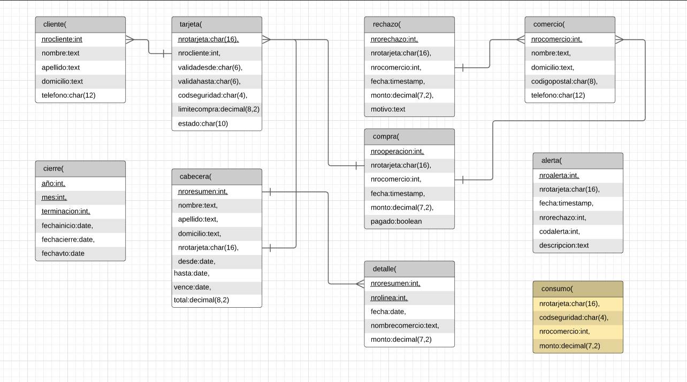

# Base de Datos: Trabajo Práctico 

## 1. Introducción

En este trabajo **se realizará una base de datos en postgreSQL mediante Go**, 
donde se representa un modelo de datos que se usa para almacenar
informacion relativa a clientes de tarjetas de credito, donde se destacan los detalles
de compra, total de gastos, infomación del comercio y el producto, rechazos
o alertas e incluso, información sobre la propia tarjeta y su propietario.

**El objetivo del programa** es que reconozca y **actúa ante situaciones tales como 
autorización de compra, generar resumenes o alertar a los clientes de posibles
problemas**. Para ello, se deberá previamente crear una base de datos respetando 
las propiedades de cada tabla, e instanciar datos competentes.

Además, **el usuario tendrá la posibilidad de crear la base de datos manualmente
y ver el "paso a paso"** de cada proceso ejecutado o la opción de que se realice todo automáticamente.
También se podrá borrar todas las identifiaciones primareas y foraneas (PK's y FK's).
 

## 2. Descripción 📋

**El programa inicia mostrando un menú principal de bienvenida** (CLI) para un manejo
más ordenado con la base de datos. Donde se podrá elegir entre crearla y cargarla
con toda la informacion necesaria automaticamente o hacerlo manualmente. También
se le agregan opciones para realizar pruebas de funcionamiento. Por último, se encuentra 
la opción de salir.


### 2.1 Modelo de menu principal

		[ 1 ] Crear Base tpgossz (Auto)
		[ 2 ] Crear Base tpgossz (Manual)
		[ 3 ] Remover PKs y FKs
		[ 4 ] Realizar consumos de prueba
		[ 5 ] Realizar resumenes de prueba
		[ 6 ] Guardar datos (BoltDB)

		[ 0 ] Salir

		
[1] Permite **crear la base de datos completa** con tablas, PK's y FK's,
**también agrega** clientes, negocios y **funciones** de forma automática. 

[2] Permite al usuario **realizar manualmente los acciones** que se realizan
de forma automatica en la opcion 1.

[3] Elimina los PK's y FK's de todas las tablas existentes
**para visualizar posibles inconvenientes** al no poseer y prescindir de las mismas.

[4] Ejecuta un procedimiento que **en funcion de los datos** cargados **en
la tabla consumos**, sirve para probar las funciones del sistema y **simular** así **compras 
validadas o rechazadas** de diferentes personas.

[5] Prueba una función que recibe sus datos de forma hardcodeda, 
pero que **guardan relación con las compras aceptadas** que se generaron a causa de 
la opción anterior. 

[6] Sirve para realizar una **comparación entre el modelo relacional con un
modelo NoSQL**, se guardan los datos de clientes, tarjetas, comercios, y compras (tres por 
cada entidad y de forma hardcodeada). Para ello, utilizamos la base de datos BoltDB.

### 2.2 Modelo de menu secundario

		[ 1 ] Eliminar Base tpgossz
		[ 2 ] Crear Base tpgossz
		[ 3 ] Conectar con Base tpgossz
		[ 4 ] Crear tablas
		[ 5 ] Agregar PKs y FKs
		[ 6 ] Popular Base de datos
		[ 7 ] Agregar Stored Procedures y Triggers

		[ 0 ] Volver
		
Cada vez que el usuario elija una opción, la función se ejecutará y hará un seguimiento
con impresiones por pantalla para indicar su estado y correcto funcionamiento. 

En caso de no elegir la opción de salida válida, se mostrará un mensaje
"No elegiste ninguno" y se volverá al menu para seleccionar la siguiente tarea.
    

### 2.3 Dificultades y Procedimientos

-_Inicio y Planificación del Proyecto_

**Para** empezar a **modelar la base de datos** decidimos utilizar el programa **_lucidchart_**
debido a que nos permitio de forma mas comoda organizar y ordenar las relaciones
entre las entidades. 



-_Creando Tablas, PK's y FK's_

Para agregar las PK's y FK's se utilizó el formato dado en clases (ver en implementación).
En este caso, se realizó una función para agregar las PK's y FK's en sus respectivas
tablas y otra para borrarlas. Resaltamos que, debido al diagrama realizado previamente, 
fue mucho más fácil visualizar de forma rápida y precisa las identificaciones y sus relaciones.

-_Instancia de Datos_

Al momento de ingresar información sobre los comercios y clientes a la base 
de datos, **en lugar de inventar y escribir manualmente**, se obtuvo la
información de paginas de internet con datos públicos y verdaderos.
Donde algunos fueron modificados a conveniencia, para usarlo a modo de prueba en
las proximas funciones a realizar. En el caso de los números de tarjetas de crédito y 
los CVV, **se utilizó un programa online** que genera los mismos de forma aleatoria, con el
fin de que la base de datos parezca mucho más realista: *https://herramientas-online.com/generador-tarjeta-credito-cvv.php* 

-_Implementación de "codmotivo" en la Tabla Rechazos_

Al momento de generar los rechazos nos dimos cuenta que **necesitabamos diferenciar por que había sido rechazada una compra**. Para hacer esto, decidimos que era más conveniente evaluar un integer (codigo de motivo) que un string (descripcion del motivo). Por lo que decidimos agregar a la tabla Rechazo una columna adicional, *codmotivo*, que funciona de forma semejante a la columna codalerta de la tabla Alerta,
en este caso a través de cinco valores numéricos se puende constatar el motivo del rechazo.

- Tarjeta no válida o no vigente = 0
- Código de seguridad inválido = 1
- Plazo de vigencia expirado = 2
- La tarjeta se encuentra suspendida = 3
- Supera límite de tarjeta = 4

-_FK's innecesarias_

En el desarrollo del trabajo ocurrieron errores debido a que al momento de querer guardar un rechazo o una
alerta relacionada a un número de tarjeta inválido, se violaba el uso de las foreing keys.
Debido a que el trabajo exige que se guarde cualquier intento de compra, sea válida o no, **decidimos eliminar 
la _FK nro tarjeta_** que relacionaba la tabla tarjeta con la tabla compra y también, la que lo hacía con la tabla alerta.
El diagrama mostrado previamente, es el resultado final de las relaciones entre las tablas.


## 3. Implementación 🔧

### Inicializar variables e Importar librerias  
Las variables sirven para conectarse a la base de datos postgreSQL. Por otro lado se importo las librerias necesarias para las conecciones tanto para la base de datos SQL y no SQL
```go
	package main
	import (
		"database/sql"
		"encoding/json"
		"fmt"
		"log"
		"strconv"
		//bolt "github.com/coreos/bbolt"
		_ "github.com/lib/pq"
		bolt "go.etcd.io/bbolt"
	)
	var (
		db               *sql.DB
		err              error
		user             = "postgres"
		password         = "1234"
		exitBool         = false
		advancedMenuBool = false
	)
```

### Funcion principal

```go
func main() {
	defer exit() // mensaje de cierre de conexion
	login(user, password) // conexion a la BBDD postgreSQL
	bienvenida() // mensaje de bienvenida al usuario   
	for {
		if advancedMenuBool {
			advancedMenu()
		} else {
			menu()
		}
		if exitBool == true {
			break
		}
	}
}
```
_nota: los comentarios son agregados para evitar alargar esta seccion, sin embargo el codigo se encuentra en el repositorio._

### Menu principal
```go
func menu() {
	menuString := `` // aca se coloca el modelo del menu principal mostrado en la seccion 2 como string
	fmt.Printf(menuString)
	var eleccion int //Declarar variable y tipo antes de escanear, esto es obligatorio
	fmt.Scan(&eleccion)
	switch eleccion {
		case 1:
			autoCreateDatabase()
		case 2:
			advancedMenuBool = true
		case 3:
			dropPKandFK()
		case 4:
			realizarConsumos()
		case 5:
			realizarResumenes()
		case 6:
			generarBoltDB()
		case 0:
			exitBool = true
			fmt.Println("Hasta Luego")
		default:
			fmt.Println("No elegiste ninguno")
	}
}
```
#### CASE 1
Dividiremos este segemento en 4 partes. De esta manera se podra observar de forma ordenada las funciones que contengan sub-funciones o metodos auxiliares

##### Eliminar, crear, conectar a la BBDD y crear tablas
```go
func autoCreateDatabase() {
	dropDatabase()
	createDatabase()
	connectDatabase()
	createTables()
	addPKandFK()
	populateDatabase()
	addStoredProceduresTriggers()
	fmt.Println("\nReady to work!")
}

func dropDatabase() {
	fmt.Println("Dropping tpgossz database if exists...")
	checkIfUsersConnected()
	_, err = db.Exec(`drop database if exists tpgossz;`)
	if err != nil {
		log.Fatal(err)
	}
	fmt.Println("tpgossz database dropped!")
}

func createDatabase() {
	fmt.Println("Creating tpgossz Database...")
	_, err = db.Exec(`CREATE DATABASE tpgossz;`)
	if err != nil {
		log.Fatal(err)
	}
	fmt.Println("tpgossz database created succesfully!")
}

func connectDatabase() {
	fmt.Println("Connecting to tpgossz database...")
	//https://notathoughtexperiment.me/blog/how-to-do-create-database-dbname-if-not-exists-in-postgres-in-golang/
	row := db.QueryRow(`SELECT EXISTS(SELECT datname FROM pg_catalog.pg_database WHERE datname = 'tpgossz');`)
	var exists bool
	err = row.Scan(&exists)
	if err != nil {
		log.Fatal(err)
	}
	if exists == false {
		fmt.Println("tpgossz database doesn't exist!")
		createDatabase()
	} else {
		db, err = sql.Open("postgres", "user="+user+" password="+password+" host=localhost dbname=tpgossz sslmode=disable")
		if err != nil {
			log.Fatal(err)
			exit()
		}
		fmt.Println("Connected tpgossz!")
	}
}

func createTables() {
	fmt.Println("Creating tables...")
	_, err = db.Exec(
		`CREATE TABLE cliente (nrocliente int, nombre text, apellido text, domicilio text, telefono varchar(12));
		 CREATE TABLE tarjeta (nrotarjeta varchar(16), nrocliente int, validadesde varchar(6), validahasta varchar(6),codseguridad varchar(4), limitecompra decimal(8,2), estado varchar(10));
		 CREATE TABLE comercio (nrocomercio int, nombre text, domicilio text, codigopostal varchar(8), telefono varchar(12));
		 CREATE TABLE compra (nrooperacion int, nrotarjeta varchar(16), nrocomercio int, fecha timestamp, monto decimal(7,2), pagado boolean);
		 CREATE TABLE rechazo (nrorechazo int, nrotarjeta varchar(16), nrocomercio int, fecha timestamp, monto decimal(7,2), motivo text, codmotivo int);
		 CREATE TABLE cierre (anio int, mes int, terminacion int, fechainicio date, fechacierre date, fechavto date);
		 CREATE TABLE cabecera (nroresumen int, nombre text, apellido text, domicilio text, nrotarjeta varchar(16), desde date, hasta date, vence date, total decimal(8,2));
 		 CREATE TABLE detalle (nroresumen int, nrolinea int, fecha date, nombrecomercio text, monto decimal(7,2));
		 CREATE TABLE alerta (nroalerta int, nrotarjeta varchar(16), fecha timestamp, nrorechazo int, codalerta int, descripcion text);
		 CREATE TABLE consumo (nrotarjeta varchar(16), codseguridad varchar(4), nrocomercio int, monto decimal(7,2));`)
	if err != nil {
		log.Fatal(err)
	} else {
		fmt.Println("Tables created succesfully!")
	}
}
```
##### Agregar las primary key y las foreing key 
```go
func addPKandFK() {
	fmt.Println("Adding PKs and FKs...")
	addPKs()
	addFKs()
	fmt.Println("PKs and FKs added succesfully!")
}

func addPKs() {
	_, err = db.Exec(`
			ALTER TABLE cliente ADD CONSTRAINT cliente_pk PRIMARY KEY (nrocliente);
			ALTER TABLE tarjeta ADD CONSTRAINT tarjeta_pk PRIMARY KEY (nrotarjeta);
			ALTER TABLE comercio ADD CONSTRAINT comercio_pk PRIMARY KEY (nrocomercio);
			ALTER TABLE compra ADD CONSTRAINT compra_pk PRIMARY KEY (nrooperacion);
			ALTER TABLE rechazo ADD CONSTRAINT rechazo_pk PRIMARY KEY (nrorechazo);
			ALTER TABLE cierre ADD CONSTRAINT cierre_pk PRIMARY KEY (anio, mes, terminacion);
			ALTER TABLE cabecera ADD CONSTRAINT cabecera_pk PRIMARY KEY (nroresumen);
			ALTER TABLE detalle ADD CONSTRAINT detalle_pk PRIMARY KEY (nroresumen, nrolinea);
			ALTER TABLE alerta ADD CONSTRAINT alerta_pk PRIMARY KEY (nroalerta);`)
	if err != nil {
		log.Fatal(err)
	}
}

func addFKs() {
	_, err = db.Exec(`
			ALTER TABLE 	tarjeta ADD CONSTRAINT tarjeta_nrocliente_fk 	FOREIGN KEY (nrocliente) REFERENCES cliente (nrocliente);
			--ALTER TABLE 	rechazo ADD CONSTRAINT rechazo_nrotarjeta_fk 	FOREIGN KEY (nrotarjeta) REFERENCES tarjeta (nrotarjeta);
			ALTER TABLE 	compra ADD CONSTRAINT compra_nrotarjeta_fk 		FOREIGN KEY (nrotarjeta) REFERENCES tarjeta (nrotarjeta);
			--ALTER TABLE 	alerta ADD CONSTRAINT alerta_nrotarjeta_fk 		FOREIGN KEY (nrotarjeta) REFERENCES tarjeta (nrotarjeta);
			ALTER TABLE 	cabecera ADD CONSTRAINT cabecera_nrotarjeta_fk 	FOREIGN KEY (nrotarjeta) REFERENCES tarjeta (nrotarjeta);
			--ALTER TABLE 	alerta ADD CONSTRAINT alerta_nrorechazo_fk 		FOREIGN KEY (nrorechazo) REFERENCES rechazo (nrorechazo);
			ALTER TABLE 	rechazo ADD CONSTRAINT rechazo_nrocomercio_fk 	FOREIGN KEY (nrocomercio) REFERENCES comercio (nrocomercio);
			ALTER TABLE 	compra ADD CONSTRAINT compra_nrocomercio_fk 	FOREIGN KEY (nrocomercio) REFERENCES comercio (nrocomercio);`)
	if err != nil {
		log.Fatal(err)
	}
}
```


##### Agregar datos de clientes, negocios, tarjetas, consumos. Tambien se agrega un función que genera los cierres

```go
func populateDatabase() {
	fmt.Println("Populating Database...")
	addClients()
	addBusiness()
	addTarjetas()
	generateCierres()
	addConsumos()
	fmt.Println("Database populated!")
}

func addClients() {
	_, err = db.Exec(`
			INSERT INTO cliente VALUES (1, 'Leandro', 'Sosa', 'Marco Sastre 4540', '541152774600');
			INSERT INTO cliente VALUES (2, 'Leonardo', 'Sanabria', 'Gaspar Campos 1815', '541148611570');
			....
			INSERT INTO cliente VALUES (20, 'Lautaro', 'Rolon', 'Azcuenaga 1913',  '541194127656');`)
	if err != nil {
		log.Fatal(err)
	}
}

func addBusiness() {
	_, err = db.Exec(`
			INSERT INTO comercio VALUES (1, 'Farmacia Tell','Juncal 699', 'B1663', '541157274612');
			INSERT INTO comercio VALUES (2, 'Optica Bedini','Peron 781', 'B1871', '541174654172');
			....
			INSERT INTO comercio VALUES (21, 'Piero', 'Tribulato 1333', 'B1201', '541142147877');`)
	if err != nil {
		log.Fatal(err)
	}
}

func addTarjetas() {
	_, err = db.Exec(`	
			INSERT INTO tarjeta VALUES ('5555899304583399', 1, '200911', '250221', '1234', 100000.90, 'vigente');
			INSERT INTO tarjeta VALUES ('5269399188431044', 2, '190918', '240928', '0334', 50000,  'vigente');
			...
			INSERT INTO tarjeta VALUES ('6326855100263642', 1, '180607', '230627', '9821', 450000.78, 'suspendida');
			INSERT INTO tarjeta VALUES ('8203564386694367', 2, '140728', '190728', '0912', 9000.99, 'anulada');`)
	if err != nil {
		log.Fatal(err)
	}
}

func generateCierres() { // Funcion que genera los cierres dependiendo de la fecha
	for nMes := 1; nMes <= 12; nMes++ {
		for terminacion := 0; terminacion <= 9; terminacion++ {
			var fInicio string
			var fCierre string
			var fVto string
			fInicio = fmt.Sprintf("2020-%v-%v", nMes, terminacion+2)
			if nMes == 12 {
				fCierre = fmt.Sprintf("2021-%v-%v", 1, terminacion+1)
				fVto = fmt.Sprintf("2021-%v-%v", 2, terminacion+11)
			} else {
				fCierre = fmt.Sprintf("2020-%v-%v", nMes+1, terminacion+1)
				fVto = fmt.Sprintf("2020-%v-%v", nMes+1, terminacion+11)
			}

			_, err = db.Exec(fmt.Sprintf("INSERT INTO cierre VALUES (2020, %v, %v, '%v', '%v', '%v');", nMes, terminacion, fInicio, fCierre, fVto))
			if err != nil {
				log.Fatal(err)
			}
		}
	}
}

func addConsumos() { 
	_, err = db.Exec(`  
			INSERT INTO consumo VALUES ('8680402479723030', '1'    , 10 , 600); --codigo de seguridad invalido
			INSERT INTO consumo VALUES ('8680402479723055', '8214' , 10 , 600); --tarjeta no valida o no vigente
			INSERT INTO consumo VALUES ('6326855100263642', '9821' , 10 , 600); --tarjeta suspendida
			INSERT INTO consumo VALUES ('8203564386694367', '0912' , 10 , 600); --tarjeta plazo de vigencia expirado
			INSERT INTO consumo VALUES ('5269399188431044', '0334' , 10 , 50001); --supera el limite de tarjeta
			...			
			INSERT INTO consumo VALUES ('8680402479723030', '8214' , 3  , 600); --compra realizada correctamente cp B1221
			INSERT INTO consumo VALUES ('8680402479723030', '8214' , 11 , 600); --compra realizada correctamente cp B1221
			INSERT INTO consumo VALUES ('8203564386694367', '0912' , 9  , 16500.00);`) --tarjeta anulada
	if err != nil {
		log.Fatal(err)
	}
}
```
_nota 2: los puntos suspensivos son agregados para evitar alargar esta seccion, sin embargo el codigo se encuentra en el repositorio._

##### Agregar funciones de autorización de compra, generar resumen y generar alertas
```go
func addStoredProceduresTriggers() {
	fmt.Println("Adding Stored Procedures and Triggers...")
	addAutorizacionDeCompra()
	addGenerarResumen()
	addCompraRechazadaTrigger()
	add2Compras1mMismoCpTrigger()
	add2Compras5mDistintoCpTrigger()
	add2RechazosPorExcesoLimiteTrigger()
	addConsumosVirtuales()
	fmt.Println("Done adding Stored Procedures and Triggers!")
}

//Función: Autorización de compra, recibe los datos de una compra—número de tarjeta, código de seguridad,
//número de comercio y monto—y crea una compra si de autoriza ó agrega un rechazo en el caso de rechazarla por algún motivo.
//El procedimiento busca si se validan todas las condiciones antes de autorizar.

func addAutorizacionDeCompra() {
	fmt.Println(" Adding 'Autorizacion De Compra' Procedure")
	_, err = db.Exec(`	CREATE OR REPLACE FUNCTION autorizacion_de_compra(nrotarjetax char , codseguridadx char , nrocomerciox int , montox decimal) returns boolean as $$
						declare
							montoCompraSum int;
							tarjetaRecord record;
							fechaActual date;
							timeActual timestamp;
							nrechazo int;
							noperacion int;
							montoTotal int;
						begin
							SELECT COUNT(nrooperacion)+1 INTO noperacion FROM compra;
							SELECT COUNT(nrorechazo)+1 INTO nrechazo FROM rechazo;
							SELECT current_date INTO fechaActual;
							SELECT * FROM tarjeta INTO tarjetaRecord WHERE nrotarjeta = nrotarjetax;
							if not found then
								SELECT current_timestamp INTO timeActual;
								INSERT INTO rechazo VALUES (nrechazo, nrotarjetax, nrocomerciox, timeActual, montox, 'tarjeta no valida o no vigente', 0);
								return false;
							elsif tarjetaRecord.codseguridad != codseguridadx THEN
								SELECT current_timestamp INTO timeActual;
								INSERT INTO rechazo VALUES (nrechazo, nrotarjetax, nrocomerciox, timeActual, montox, 'codigo de seguridad invalido', 1);
								RETURN false;
							elsif CAST(tarjetaRecord.validahasta as date) < fechaActual THEN /* arreglar */
								SELECT current_timestamp INTO timeActual;
								INSERT INTO rechazo VALUES (nrechazo, nrotarjetax, nrocomerciox, timeActual, montox, 'plazo de vigencia expirado', 2);
								RETURN false;
							elsif tarjetaRecord.estado = 'suspendida' THEN
								SELECT current_timestamp INTO timeActual;
								INSERT INTO rechazo VALUES (nrechazo, nrotarjetax, nrocomerciox, timeActual, montox, 'la tarjeta se encuentra suspendida', 3);
								RETURN false;
							end if;
							SELECT SUM(monto) INTO montoCompraSum FROM compra WHERE nrotarjeta=nrotarjetax and pagado = false;
							montoTotal := montoCompraSum + montox;
							IF tarjetaRecord.limitecompra < montoTotal THEN
								SELECT current_timestamp into timeActual;
								INSERT INTO rechazo VALUES (nrechazo, nrotarjetax, nrocomerciox, timeActual, montox,'supera limite de tarjeta', 4);
								return false;
							END IF;
							SELECT current_timestamp INTO timeActual;
							INSERT INTO compra VALUES (noperacion, nrotarjetax, nrocomerciox, timeActual, montox, false);
							RETURN true;
						END;
						$$language plpgsql;`)
	if err != nil {
		log.Fatal(err)
	}
}

//Función: Generación del Resumen contiene la lógica que reciba como parámetros el número de cliente, y el periodo del
//año, y que guarda en las tablas que corresponda los datos del resumen con la información pertinente 
//(nombre y apellido, dirección, número de tarjeta, periodo del resumen, fecha de vencimiento, todas las compras del
//periodo, y total a pagar).

func addGenerarResumen() {
	fmt.Println(" Adding 'Generar resumen' Procedure")
	_, err = db.Exec(`  CREATE OR REPLACE FUNCTION generar_resumen(nroclientex int , mesx int , aniox int) returns void as $$
						declare 
							ncliente record;
							ntarjeta record;
							ncierre record;
							ncomercio record;
							unaCompra record;
							fechaEnDate date;
							tarjetaEnText text;
							ultimoDigito text;
							deudaTotal int;
							nresumen int;
							nlinea int;
							digito int;
						begin 
							SELECT COUNT(nroresumen) INTO nresumen FROM cabecera;
							SELECT * INTO ncliente FROM cliente WHERE nrocliente = nroclientex ;
							SELECT * INTO ntarjeta FROM tarjeta WHERE nrocliente = nroclientex and estado = 'vigente'; 
							tarjetaEnText := text (ntarjeta.nrotarjeta); /* paso a texto el numero de tarjeta*/
							SELECT right(tarjetaEnText,1) INTO ultimoDigito; /*el ultimo digito*/
							digito := to_number(ultimoDigito,'9');    /*9 es formato de mascara*/
							SELECT * into ncierre from cierre where anio = aniox and mes = mesx and terminacion = digito; 
							SELECT sum(monto) into deudaTotal from compra where nrotarjeta = ntarjeta.nrotarjeta and pagado = false;
							INSERT INTO cabecera VALUES (nresumen,ncliente.nombre,ncliente.apellido,ncliente.domicilio,ntarjeta.nrotarjeta,ncierre.fechainicio,ncierre.fechacierre,ncierre.fechavto,deudaTotal);
							FOR unaCompra IN SELECT * FROM compra WHERE nrotarjeta = ntarjeta.nrotarjeta loop
								SELECT * INTO ncomercio FROM comercio WHERE nrocomercio = unaCompra.nrocomercio;
								SELECT CAST (unaCompra.fecha AS date) INTO fechaEnDate;
								SELECT COUNT(nrolinea) INTO nlinea FROM detalle WHERE nroresumen = nresumen;
								INSERT INTO detalle VALUES (nresumen,nlinea,fechaEnDate,ncomercio.nombre,unaCompra.monto);
								unaCompra.pagado := true;
							END loop;
						END;
						$$ language plpgsql;`)
	if err != nil {
		log.Fatal(err)
	}
}

/*Función que genera una alerta automaticamente después de que se agregue un rechazo por compra rechazada*/

func addCompraRechazadaTrigger() {
	fmt.Println(" Adding 'Alerta Compra Rechazada' Procedure and trigger")
	_, err = db.Exec(`  CREATE OR REPLACE FUNCTION alerta_compra_rechazada() RETURNS TRIGGER AS $$
						DECLARE
							nalerta int;
						BEGIN
							SELECT MAX(nroalerta) + 1 INTO nalerta FROM alerta;
							IF nalerta ISNULL THEN 
								nalerta := 1; 
							END IF;
								INSERT INTO alerta VALUES (nalerta, new.nrotarjeta, new.fecha, new.nrorechazo, 0, 'Compra Rechazada');
							RETURN new;
						END;
						$$ language plpgsql;
						CREATE TRIGGER compra_rechazada
						BEFORE INSERT ON rechazo
						FOR EACH ROW
						EXECUTE PROCEDURE alerta_compra_rechazada();`)
	if err != nil {
		log.Fatal(err)
	}
}

/*Función que genera una alerta al haber 2 compras realizadas en un lapso menor de un minuto con el mismo codigo postal*/

func add2Compras1mMismoCpTrigger() {
	fmt.Println(" Adding 'Alerta Compra 1m mismo CP' Procedure and trigger")
	_, err = db.Exec(`  CREATE OR REPLACE FUNCTION alerta_compra_1m_mismoCP() RETURNS TRIGGER AS $$
						DECLARE
							nalerta int;
							ncompras int;
						BEGIN
							SELECT count(*) INTO ncompras 
							FROM compra AS cp
							JOIN comercio AS cm on cm.nrocomercio = cp.nrocomercio
							WHERE cp.nrotarjeta = new.nrotarjeta AND cp.nrocomercio != new.nrocomercio  AND cm.codigopostal = (SELECT codigopostal 
																														FROM comercio
																														WHERE new.nrocomercio = nrocomercio) AND new.fecha - cp.fecha <= INTERVAL '1' MINUTE;						
							IF ncompras = 1 then
								SELECT MAX(nroalerta)+1 INTO nalerta FROM alerta;
								IF nalerta ISNULL THEN 
									nalerta := 1; 
								END IF;
									INSERT INTO alerta VALUES (nalerta, new.nrotarjeta, new.fecha, null, 1, 'Se registraron dos compras en un lapso menor de un minuto en comercios distintos ubicados en el mismo codigo postal');
							END IF;
							RETURN new;
						END;
						$$ language plpgsql;
						CREATE TRIGGER compra_1m_mismoCP
						AFTER INSERT ON compra
						FOR EACH ROW
						EXECUTE PROCEDURE alerta_compra_1m_mismoCP();`)
	if err != nil {
		log.Fatal(err)
	}
}

// Función que genera una alerta al haber 2 compras realizadas en un lapso menor de 5 minutos con distinto codigo postal

func add2Compras5mDistintoCpTrigger() {
	fmt.Println(" Adding 'Alerta Compra 5m distinto CP' Procedure and trigger")
	_, err = db.Exec(`  CREATE OR REPLACE FUNCTION alerta_compra_5m_distintoCP() returns trigger as $$
						declare
							nalerta int;
							ncompras int;
						begin
							SELECT COUNT(*) INTO ncompras 
							FROM compra AS cp
							JOIN comercio AS cm on cm.nrocomercio = cp.nrocomercio
							WHERE cp.nrotarjeta = new.nrotarjeta AND cm.codigopostal != (SELECT codigopostal 
																						FROM comercio
																						WHERE new.nrocomercio = nrocomercio) AND new.fecha - fecha <= interval '5' minute;						
							if ncompras = 1 then
								SELECT MAX(nroalerta)+1 into nalerta from alerta;
								IF nalerta ISNULL THEN 
									nalerta := 1; 
								end if;
									INSERT INTO alerta VALUES (nalerta, new.nrotarjeta, new.fecha, null, 5, 'Se registraron dos compras en un lapso menor a 5 minutos en comercios con diferentes codigos postales');
							END IF;
							RETURN new;
						END;
						$$ language plpgsql;
						CREATE TRIGGER compra_5m_distintoCP
						AFTER INSERT ON compra
						FOR EACH ROW
						EXECUTE PROCEDURE alerta_compra_5m_distintoCP();`)
	if err != nil {
		log.Fatal(err)
	}
}

// Función que genera una alerta al intentar hacer una compra en donde se exceda el monto máximo de la tarjeta

func add2RechazosPorExcesoLimiteTrigger() {
	fmt.Println(" Adding 'Alerta 2 compras rechazadas exceso limite' Procedure and trigger")
	_, err = db.Exec(`  CREATE OR REPLACE FUNCTION alerta_dos_rechazos_por_execeso_limite() returns trigger as $$
						DECLARE
							nalerta int;
							nrechazos int;
						BEGIN						
							SELECT COUNT(*) INTO nrechazos
							FROM rechazo AS rz
							WHERE rz.nrotarjeta = new.nrotarjeta AND 
								rz.codmotivo = 4 AND 
								rz.fecha BETWEEN date(new.fecha) AND date(new.fecha) + INTERVAL '23:59:59';
							IF nrechazos = 1 then
								UPDATE tarjeta SET estado = 'suspendida' where nrotarjeta = new.nrotarjeta;
								SELECT MAX(nroalerta)+1 INTO nalerta from alerta;
								IF nalerta ISNULL THEN 
									nalerta := 1; 
								end if;
									INSERT INTO alerta VALUES (nalerta, new.nrotarjeta, new.fecha, new.nrorechazo, 32, 'Se registraron dos rechazos por exceso de limite en el dia. La tarjeta ha sido suspendida preventivamente');
							END IF;
							RETURN new;
						END;
						$$ language plpgsql;
						CREATE TRIGGER compra_rechazada_exceso
						BEFORE INSERT ON rechazo
						FOR EACH ROW
						EXECUTE PROCEDURE alerta_dos_rechazos_por_execeso_limite();`)
	if err != nil {
		log.Fatal(err)
	}
}

// Función que incia el proceso de testeo utilizando consumos virtuales

func addConsumosVirtuales() {
	fmt.Println(" Adding 'Consumos Virtuales' Procedure")
	_, err = db.Exec(`  CREATE OR REPLACE FUNCTION procedimiento_testeo() returns void as $$
						DECLARE 
							tupla record;
						BEGIN 
							FOR tupla IN SELECT * FROM consumo loop
								PERFORM autorizacion_de_compra(tupla.nrotarjeta, tupla.codseguridad, tupla.nrocomercio, tupla.monto);
							END loop;
						END;
						$$ language plpgsql;`)
	if err != nil {
		log.Fatal(err)
	}
}
```

CASE 3
```go
func dropPKandFK() {
	fmt.Println("Removing PKs and FKs...")
	dropFKs()
	dropPKs()
	fmt.Println("PKs and FKs removed succesfully!")
}

func dropPKs() {
	_, err = db.Exec(`
			ALTER TABLE cliente 	DROP CONSTRAINT cliente_pk;
			ALTER TABLE tarjeta 	DROP CONSTRAINT tarjeta_pk;
			ALTER TABLE comercio 	DROP CONSTRAINT comercio_pk;
			ALTER TABLE compra 	DROP CONSTRAINT compra_pk;
			ALTER TABLE rechazo 	DROP CONSTRAINT rechazo_pk;
			ALTER TABLE cierre 	DROP CONSTRAINT cierre_pk;
			ALTER TABLE cabecera 	DROP CONSTRAINT cabecera_pk;
			ALTER TABLE detalle 	DROP CONSTRAINT detalle_pk;
			ALTER TABLE alerta 	DROP CONSTRAINT alerta_pk;`)
	if err != nil {
		log.Fatal(err)
	}
}

func dropFKs() {
	_, err = db.Exec(`
			ALTER TABLE tarjeta 	DROP CONSTRAINT tarjeta_nrocliente_fk;
			--ALTER TABLE rechazo 	DROP CONSTRAINT rechazo_nrotarjeta_fk;
			ALTER TABLE compra 	DROP CONSTRAINT compra_nrotarjeta_fk;
			--ALTER TABLE alerta 	DROP CONSTRAINT alerta_nrotarjeta_fk;
			ALTER TABLE cabecera 	DROP CONSTRAINT cabecera_nrotarjeta_fk;
			--ALTER TABLE alerta 	DROP CONSTRAINT alerta_nrorechazo_fk;
			ALTER TABLE rechazo 	DROP CONSTRAINT rechazo_nrocomercio_fk;
			ALTER TABLE compra 	DROP CONSTRAINT compra_nrocomercio_fk;`)
	if err != nil {
		log.Fatal(err)
	}
}
```
CASE 4
```go
func realizarConsumos() {
	fmt.Println("Realizando consumos de prueba")
	_, err = db.Exec(`SELECT procedimiento_testeo();`)
	if err != nil {
		log.Fatal(err)
	}
	fmt.Println("Consumos de prueba realizados!")
}
```
CASE 5
```go
func realizarResumenes() {
	fmt.Println("Realizando resumenes de prueba")
	_, err = db.Exec(`
		SELECT generar_resumen(2,11,2020);
		SELECT generar_resumen(3,11,2020);
		SELECT generar_resumen(4,11,2020);
		SELECT generar_resumen(6,11,2020);`)
			
	if err != nil {
		log.Fatal(err)
	}
	fmt.Println("Resumenes de prueba realizados!")
}
```
## 4. Conclusiones

Una vez realizado el proyecto aprendimos el correcto manejo de SQL en Go, el uso de Postgres, un vistazo 
a una base datos no relacional y la administración de una base de datos relacionada con tarjetas de crédito 
con una simulación realista. La comprensión de los temas incluidos en el trabajo práctico nos hicieron cambiar 
drásticamente nuestra visión sobre los mismos, porque hasta el momento de iniciarlo, solo habíamos indagado en 
peticiones simples con tablas pequeñas o poco relacionadas entre sí. 

Esta diferencia se ve remarcada con el uso de Boltdb, donde notamos que trabajar con postgres nos 
permitía un mayor manejo e interacción con la base de datos, al permitirnos crear funciones como autorización 
de compra y demás el simple hecho de llenar una tabla con datos de forma más sencilla. En cambio, notamos que 
BoltDB parece más orientado a una base de datos pequeña, donde lo que se premie sea la organización y la visión
sobre datos guardados, sin tener actuar sobre ellos.   

En el caso de que tuvieramos que repetir el proyecto realizariamos pequeños cambios como: poder tener comandos 
dentro del CLI que permitiecen al usuario ingresar clientes, negocios, consumos, etc. También es verdad que esta 
herramientas de trabajo fue nueva para todos los integrantes del equipo, por ello, fue un poco intrincado el inicio 
del proyecto, pero una vez afianzado lo más básico del trabajo práctico (la conexión con el servidor, la creación de 
la base de datos con sus tablas respectivas y sus PK's y FK's), lo demás fluyó con mayor facilidad para nosotros.

Una vez observado el resultado del proyecto, nos quedamos con ganas de implementar nuevas base de datos de mayor
complejidad o con diferentes particularidades, también de hacer modificaciones sustanciales al código presentado 
para mayor cantidad de funcionalidades para el programa que creamos o para aumentar la escalabilidad del proyecto.
